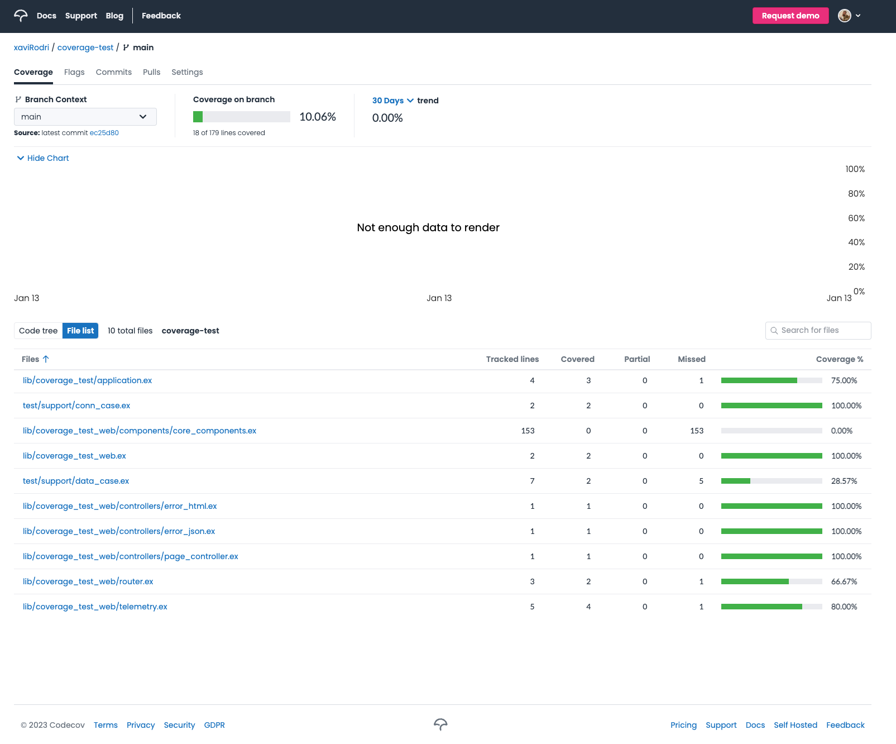
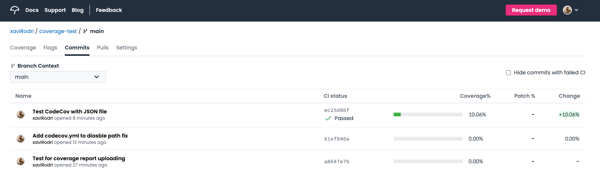

# CoverageTest

This app is just a plain Elixir (1.14) Phoenix (1.7.0) application used to test how to upload test coverage reports
to [CodeCov](https://about.codecov.io/).

Our configuration is intended only for public repos in Github. If you want to use it for other purposes, please take 
a look at [CodeCov's documentation](https://docs.codecov.com/docs).

These are the steps to follow in order to configure your Phoenix application and its repository:

1. Create your repo [here](https://github.com/new).
2. (_Optional_) Set up a [team Bot](https://docs.codecov.com/docs/team-bot) to use Github's integration with CodeCov.
3. Create your application (with some tests to check that this works fine).
4. Add a coverage report tool. We have used [excoveralls](https://hexdocs.pm/excoveralls/readme.html).
5. Configure the previous tool so it also is able to generate JSON reports. E.g. for `excoveralls`, we need to add this to the `project/0` function in the `mix.exs` file:

```Elixir
def project do
  [
    ...
    test_coverage: [tool: ExCoveralls],
    preferred_cli_env: [
      ...
      "coveralls.json": :test
    ]
  ]
end
```

6. Add a CI pipeline for Github Actions and adapt it to your app (e.g. add or delete services like the database). We have used one from the [fly.io blog](https://fly.io/phoenix-files/github-actions-for-elixir-ci/). Find it [here](.github/workflows/elixir.yaml).
7. Modify the test step in the CI to be run with `excoveralls` and generate the JSON coverage report: `mix coveralls.json`.

```yaml
# Step: Execute the tests and generate the coverage report using excoveralls.
- name: Run tests & generate coverage report
  run: mix coveralls.json
```

1. Add a last step in the CI to upload the coverage report to CodeCov using [CodeCov's Github Action](https://github.com/marketplace/actions/codecov).

```yaml
# Step: Upload coverage report to CodeCov.
- name: Upload coverage report
  uses: codecov/codecov-action@v3
  with:
    files: ./cover/excoveralls.json
    verbose: true # optional
```

9. Push all these changes to your repository and check if the CI pipeline passed.
10. Visit your CodeCov page to see the results!

## Results

Here you can find some screenshots of how your CodeCov reports will look like.

### Branch report


### Commits report view


